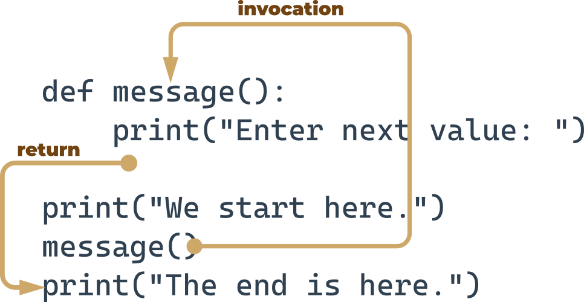

# Module 4

# Section 1 – Functions

- if a particular fragment of the code begins to appear in more than one place, consider the possibility of isolating it in the form of a function invoked from the points where the original code was placed before.
- A good, attentive developer divides the code (or more accurately: the problem) into well-isolated pieces, and encodes each of them in the form of a function.
- if a piece of code becomes so large that reading and understating it may cause a problem, consider dividing it into separate, smaller problems, and implement each of them in the form of a separate function.

```
def function_name():
    function_body
```

- It always starts with the keyword def (for define)
- next after def goes the name of the function (the rules for naming functions are exactly the same as for naming variables)
- after the function name, there's a place for a pair of parentheses (they contain nothing here, but that will change soon)
- the line has to be ended with a colon;
- the line directly after def begins the function body ‒ a couple (at least one) of necessarily nested instructions, which will be executed every time the function is invoked; note: the function ends where the nesting ends, so you have to be careful.



- when you invoke a function, Python remembers the place where it happened and jumps into the invoked function;
- the body of the function is then executed;
- reaching the end of the function forces Python to return to the place directly after the point of invocation.

**Remember - Python reads your code from top to bottom. It's not going to look ahead in order to find a function you forgot to put in the right place ("right" means "before invocation".)**

_You mustn't have a function and a variable of the same name._

https://docs.python.org/3/library/functions.html

- parameters exist only inside functions in which they have been defined, and the only place where the parameter can be defined is a space between a pair of parentheses in the def statement;
- assigning a value to the parameter is done at the time of the function's invocation, by specifying the corresponding argument.
