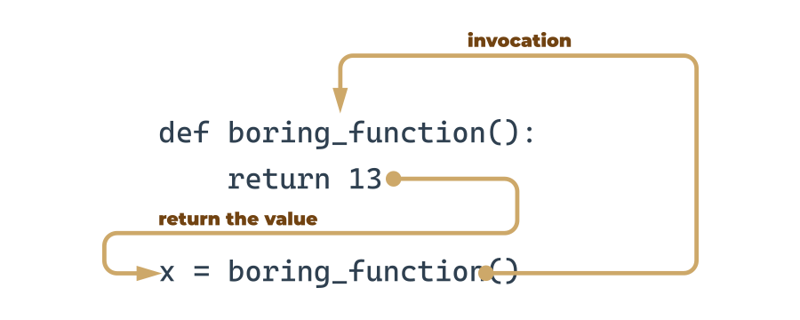
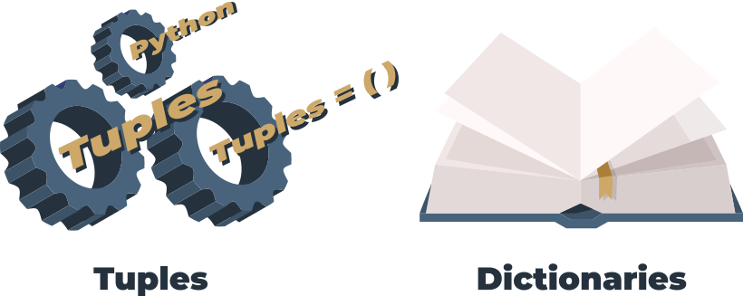

# Module 4

# Section 1 – Functions

- if a particular fragment of the code begins to appear in more than one place, consider the possibility of isolating it in the form of a function invoked from the points where the original code was placed before.
- A good, attentive developer divides the code (or more accurately: the problem) into well-isolated pieces, and encodes each of them in the form of a function.
- if a piece of code becomes so large that reading and understating it may cause a problem, consider dividing it into separate, smaller problems, and implement each of them in the form of a separate function.

```
def function_name():
    function_body
```

- It always starts with the keyword def (for define)
- next after def goes the name of the function (the rules for naming functions are exactly the same as for naming variables)
- after the function name, there's a place for a pair of parentheses (they contain nothing here, but that will change soon)
- the line has to be ended with a colon;
- the line directly after def begins the function body ‒ a couple (at least one) of necessarily nested instructions, which will be executed every time the function is invoked; note: the function ends where the nesting ends, so you have to be careful.


- when you invoke a function, Python remembers the place where it happened and jumps into the invoked function;
- the body of the function is then executed;
- reaching the end of the function forces Python to return to the place directly after the point of invocation.

**Remember - Python reads your code from top to bottom. It's not going to look ahead in order to find a function you forgot to put in the right place ("right" means "before invocation".)**

_You mustn't have a function and a variable of the same name._

https://docs.python.org/3/library/functions.html

- parameters exist only inside functions in which they have been defined, and the only place where the parameter can be defined is a space between a pair of parentheses in the def statement;
- assigning a value to the parameter is done at the time of the function's invocation, by specifying the corresponding argument.

### Effects and results: the return instruction



### A few words about None

Its data doesn't represent any reasonable value ‒ actually, it's not a value at all; hence, it mustn't take part in any expressions.

**Note: None is a keyword**

There are only two kinds of circumstances when None can be safely used:

- when you assign it to a variable (or return it as a function's result)
- when you compare it with a variable to diagnose its internal state.
- Don't forget this: if a function doesn't return a certain value using a return expression clause, it is assumed that it implicitly returns `None`.

### Functions and scopes

The scope of a name (e.g., a variable name) is the part of a code where the name is properly recognizable
For example, the scope of a function's parameter is the function itself. The parameter is inaccessible outside the function.

### Recursion

recursion is a technique where a function invokes itself.

### Sequence types and mutability

`A sequence` type is a type of data in Python which is able to store more than one value (or less than one, as a sequence may be empty), and these values can be sequentially (hence the name) browsed, element by element.

As the for loop is a tool especially designed to iterate through sequences, we can express the definition as: a sequence is data which can be scanned by the for loop.

`Mutability` − is a property of any Python data that describes its readiness to be freely changed during program execution. There are two kinds of Python data: mutable and immutable.

Mutable data can be freely updated at any time.

## Dictionaries

The dictionary is another Python data structure. It's not a sequence type (but can be easily adapted to sequence processing) and it is mutable.



**Dictionary is a set of key-value pairs. Note:**

- each key must be unique − it's not possible to have more than one key of the same value;
- a key may be any immutable type of object: it can be a number (integer or float), or even a string, but not a list;
- a dictionary is not a list − a list contains a set of numbered values, while a dictionary holds pairs of values;
- the len() function works for dictionaries, too − it returns the number of key-value elements in the dictionary;
- a dictionary is a one-way tool − if you have an English-French dictionary, you can look for French equivalents of English terms, but not vice versa.
- keys are case-sensitive

## Errors – the developer's daily bread

### The try-except branch

```
try:
	# It's a place where
	# you can do something
    # without asking for permission.
except:
	# It's a spot dedicated to
    # solemnly begging for forgiveness
```

You can see two branches here:

- first, starting with the try keyword – this is the place where you put the code you suspect is risky and may be terminated in case of error; note: this kind of error is called an exception, while the exception occurrence is called raising – we can say that an exception is (or was) raised;
- second, the part of the code starting with the except keyword is designed to handle the exception; it's up to you what you want to do here: you can clean up the mess or you can just sweep the problem under the carpet (although we would prefer the first solution).

So, we could say that these two blocks work like this:

- the try keyword marks the place where you try to do something without permission;
- the except keyword starts a location where you can show off your apology talents.

#### ZeroDivisionError

This appears when you try to force Python to perform any operation which provokes division in which the divider is zero, or is indistinguishable from zero.

#### ValueError

Expect this exception when you're dealing with values which may be inappropriately used in some context.

#### TypeError

This exception shows up when you try to apply a data whose type cannot be accepted in the current context.

#### AttributeError

This exception arrives – among other occasions – when you try to activate a method which doesn't exist in an item you're dealing with.

#### SyntaxError

This exception is raised when the control reaches a line of code which violates Python's grammar.

### Bug vs. debug

The basic measure a developer can use against bugs is – unsurprisingly – a debugger, while the process during which bugs are removed from the code is called debugging.

### Some useful tips

- Try to tell someone
- Try to isolate the problem.
- If the bug has appeared recently and didn't show up earlier, analyze all the changes you've
- introduced into your code – one of them may be the reason.
- Take a break
- Be optimistic – you'll find the bug eventually; we promise you this.
